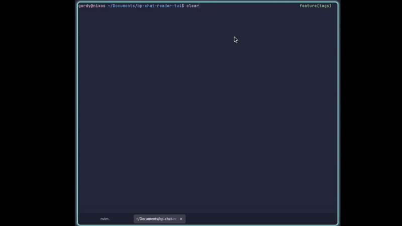
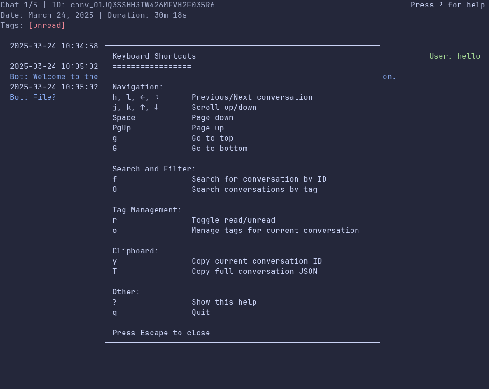

# Botpress Chat Transcript Viewer TUI


Do you need to read through hundreds of [Botpress](www.botpress.com) chats? The admin dashboard is great, but it takes _at least_ three clicks and two dynamic content panes to load before you can read _just one_ chat - and then 2 - 3 more clicks to load up the next one. There's also not an easy way to mark transcripts as read to keep track of which ones you have and have not read.

This app aims to fix those problems by:
1. Fetching conversations and messages from Botpress servers and saving them locally
2. Displaying conversations in a snappy Terminal User Interface (TUI)
3. Tracking metadata like read/unread and other custom flags

## Quickstart



### 1. Get Access Data
You'll need three things from Botpress:
1. **Workspace Id**
2. **Bot Id**
3. **Personal Access Token (PAT)** See [documentation here](https://botpress.com/docs/api-reference/authentication#1-personal-access-token-pat)

Set these in a file called `.env` see [.env.sample](./.env.sample) for a template

### 2. Fetch Transcripts
If you're running this with nix, you can call the app with python:
```bash
fetch --output data/my_chat_transcripts.jsonl --limit 40
```
If you're running this with uv, you can call the app with `uv run`
```bash
uv run fetch --output data/my_chat_transcripts.jsonl --limit 40
```
This will pull 40 chat transcripts that have _at least one_ user message.

### 3. View Transcripts
If you're running with nix, call the viewer with python:
```bash
python src/viewChats.py --file data/my_chat_transcripts.jsonl
```
Or with uv:
```bash
uv run src/viewChats.py --file data/my_chat_transcripts.jsonl
```

> Note: You don't _have_ to save transcripts to a data/ directory, but I think it is good practice. The .gitignore will not track that folder, so if you fork this repo there is no risk of leaking your chat transcripts.

## Installation

### Nix Flake
This project was developed as a [Nix Flake](www.nixos.org) to be deterministic and reproducible on any machine. Nix has a _very steep_ learning curve, so if you're not already using Nix, use uv below.

To install via nix, simply open a nix shell in the root dir with:
```bash
nix develop
```
Packages will automatically be downloaded, env vars taken from .env, and aliases added for `fetch` and `view`. You should be good to go!

### uv
There is also a [pyproject.toml](./pyproject.toml) provided for use with either [uv](https://astral.sh/blog/uv) or [poetry](https://python-poetry.org/). Install dependencies with
```bash
# For uv
uv install
# For poetry
poetry install
```
You can then run the fetch and view scripts with aliases:
```bash
uv run fetch --output data/my_chat_transcripts.jsonl --limit 40
poetry run view --file data/my_chat_transcripts.jsonl --limit 40
```

## Botpress Conversation Fetcher

This script fetches conversation transcripts from the Botpress Cloud API, filters out messages without at least one message from a user (direction: "incoming"), and saves the relevant data incrementally to a JSON Lines (`.jsonl`) file.

The incremental saving means that if the script is interrupted, the conversations already fetched and processed will be present in the output file.

It runs up to 10 API calls in parallel, though this can be decreased by passing a `-c` flag in the command. Lower concurrency = slower chat downloads. Botpress _will_ rate limit you if you are too aggressive on concurrency, so 10 is a hard-coded limit.

### Command Flags
* `--output -o      Output destination, must be a .jsonl file`
* `--limit -l       How many chats to save. Does not include chats without a user message. For example, -l 50 will have the script keep fetching transcripts until it finds and saves 50 with at least one user message.`
* `--concurrent -c  How many parallel API calls to make per batch. Higher = faster, hard limit of 10`

## Botpress Conversation Viewer

This is a cool TUI visualizer for chat transcripts generated by the above scripts. Run it with:

```bash
python src/viewChats.py --file data/bot_chat_output.json
```

### Keyboard Shortcuts:



**Navigation**
* `h, l, ←, →`          Previous/Next conversation
* `j, k, ↑, ↓`          Scroll up/down
* `Space`               Page down
* `PgUp`                Page up
* `g`                   Go to top
* `G`                   Go to bottom

**Search and Filter**
* `f`                   Search for conversation by ID
* `O`                   Search conversations by tag (Capital O, NOT zero)

**Tag Management**
* `r`                   Toggle read/unread
* `o`                   Manage tags for current conversation (Lowercase o, NOT zero)

**Clipboard**
* `y`                   Copy current conversation ID
* `T`                   Copy full conversation JSON

**Other**
* `?`                   Show this help
* `q`                   Quit

# TODOs
- [x] Add shortcut [f] to search by conversation id
- [x] Refactor fetch and view into smaller files
- [x] Add render option for buttons/choices
- [ ] Add render option for images/cards
